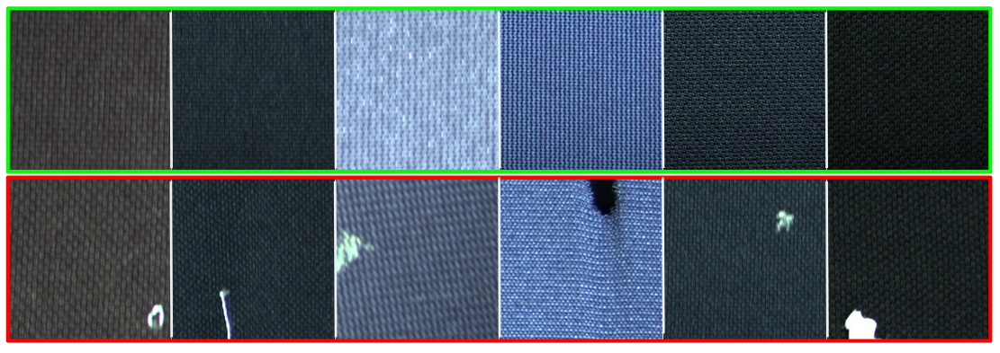
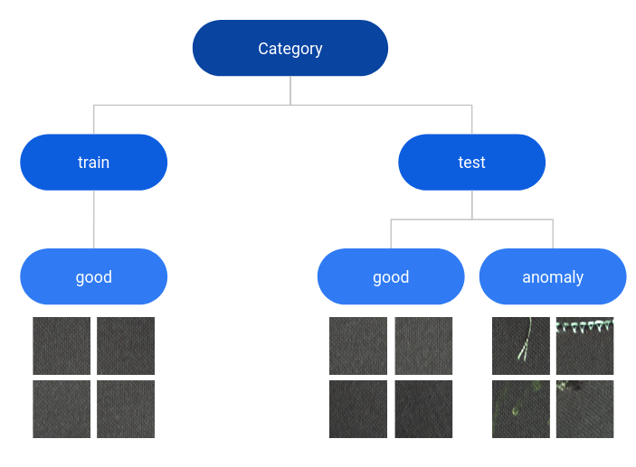
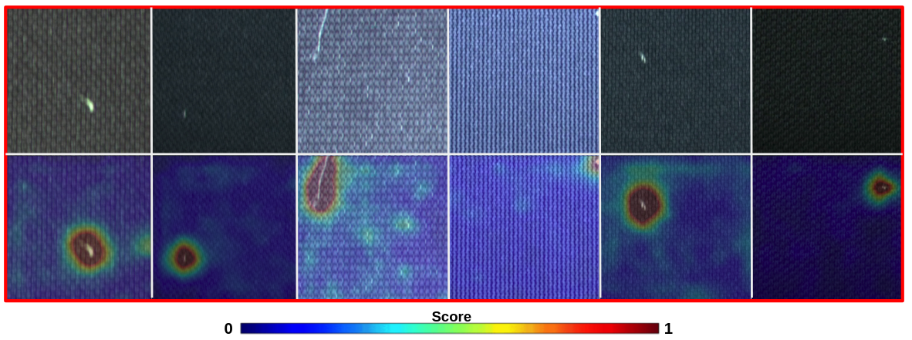

<p align="center">
  
</p>

## Description
Introduction of new dataset for unsupervised fabric defect detection 
This dataset aims to provide a color dataset with real industrial fabric defect gathered in a visiting machine with several industrial cameras.
It has been designed with the same nomenclature as MVTEC AD dataset (https://www.mvtec.com/company/research/datasets/mvtec-ad) for unsupervised anomaly detection. 

<p align="center">
  
</p>

| Type        | Total      | Train(Good) | Test(Good) | Test(Defective)  | Sample | 
| ------|-----|-----| ------|-----|-----|
| type1cam1  	| 386 	| 272 	| 28 	| 86 	| |
| type2cam2  	| 257 	| 199 	| 19 	| 39 	| |
| type3cam1  	| 689 	| 588 	| 54 	| 47 	| |
| type4cam2  	| 229 	| 199 	| 19 	| 11 	| |
| type5cam2  	| 298 	| 199 	| 19 	| 80 	| |
| type6cam2  	| 291 	| 199 	| 19 	| 73 	| |
| type7cam2  	| 917 	| 711 	| 89 	| 117 	| |
| type8cam1  	| 868 	| 711 	| 89 	| 68 	| |
| type9cam2 	| 856 	| 721 	| 86 	| 49 	| |
| type10cam2 	| 871 	| 717 	| 90 	| 64 	| |

## Download 

The dataset can be downloaded in google drive with this link : LIEN DRIVE 

## Citation
If you use this dataset, please cite
```
@inproceedings{Thomine_2023_Knowledge,
    author    = {Thomine, Simon and Snoussi, Hichem},
    title     = {Distillation-based fabric anomaly detection},
    booktitle = {Textile Research Journal},
    month     = {August},
    year      = {2023}
}
```

## Utilisation
This dataset is designed for unsupervised anomaly detection task but can also be used for domain-generalization approach.
The nomenclature is designed as : 
<p align="center">
  
</p>

- category/
  - train/
    - good/
      - img1.png
      - ...
  - test/
    - anomaly/
      - img1.png
      - ...
    - good/
      - img1.png
      - ...

As in any unsupervised training, train data are defect-free. Defective samples are only in the test set.

## Exemples

Exemple of defect segmentation obtained with our knowledge distillation-based method
<p align="center">
  
</p>


## Documentation

List of articles related to the subject of textile defect detection

- MixedTeacher : Knowledge Distillation for fast inference textural anomaly detection (https://arxiv.org/abs/2306.09859)
- FABLE : Fabric Anomaly Detection Automation Process (https://arxiv.org/abs/2306.10089)


## Auteurs

- Simon Thomine <sup>1</sup>, PhD student - [@SimonThomine](https://github.com/SimonThomine) - simon.thomine@utt.fr
- Hichem Snoussi <sup>1</sup>, Full Professor

<sup>1</sup> University of Technology of Troyes, France

## Licence


This project is under the MIT license [MIT](https://opensource.org/licenses/MIT).
